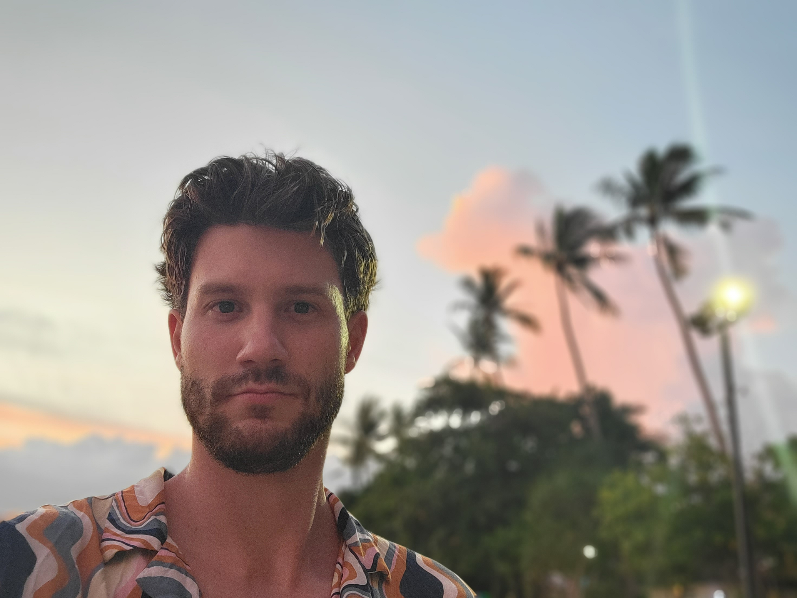

# About

 

 
My name is Blaz Pocrnja, I am a Croatian-Canadian artist and aspiring animator living
in Vancouver, Canada. I am currently studying Fine Arts at Langara College.

Prior to the COVID pandemic, I studied and worked as a software developer earning my bachelors in Computer Science. However, like many during the pandemic, I was forced to reevaluate my life path, to rediscover what brought me meaning and joy. That was when I decided to pursue art and animation, to affirm my inner child’s need for creative expression, a need that had been ignored through the pressures of adolescence.

My practice is largely influenced by Dharmic and Japanese thought. You’ll find various references to Buddhism, ukiyo-e, Japanese literature, and of course anime and manga in my work. I’m inspired by the likes of Akira Toryama, Hayao Miyazaki, Hideaki Anno, Yusuke Murata, Toshio Saeki, and Haruki Murakami – just to name a few!

I prefer to approach each new work through the _Deleuzian_ forces that arise spontaneously in my subconscious. Whether it be an image that flashes in my mind, an embodied feeling in the act of creation, a recurring motif that appears in my life time-and-time again, my aim remains simply to create a compelling image that can capture in the moment the complex ebb and flow of these forces. It is a joy afterwards to dissect my own work, to find themes and patterns that emerge in the light of my conscious mind through the act of creation.
